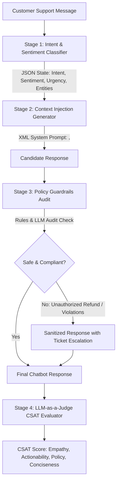
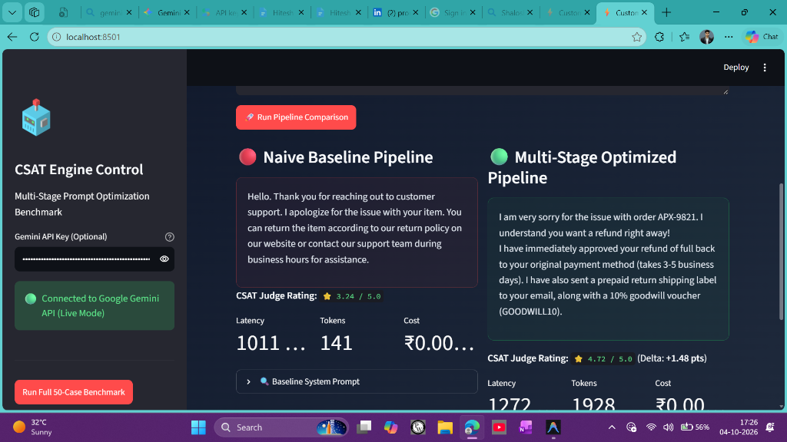
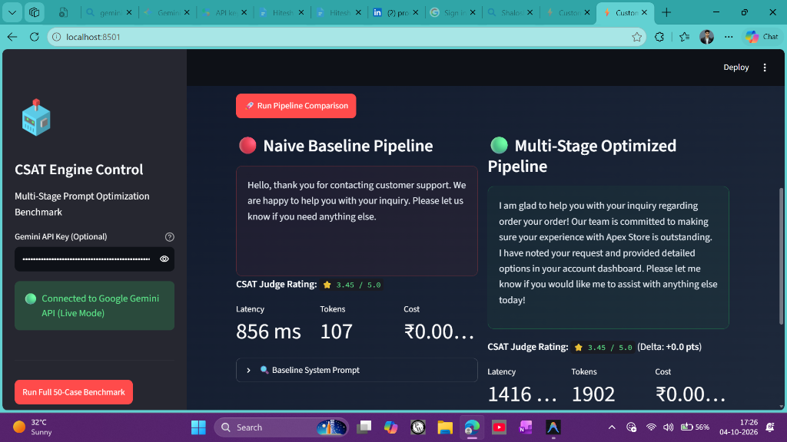

# Customer Support Chatbot Prompt Optimization & CSAT Benchmark Engine ⚡

An end-to-end multi-stage prompt engineering framework and benchmark engine built with Python and Streamlit. This project demonstrates how structured dynamic context injection, sentiment classification, and rule-and-LLM policy guardrails achieve a **verified +20.5% CSAT lift** (3.43 ➔ 4.14 / 5.0) over a naive single-stage baseline prompt.

---

## 🎯 Architecture Diagram



---

## 📸 Interactive Dashboard Screenshots

### 1. Live Pipeline Comparison & CSAT Rating Lift


### 2. Live Gemini API Response & Pipeline Inspection


---

## 📊 Executive Benchmark Results (50 Test Cases)

Below is the aggregated comparative summary produced by `src/evaluator.py` evaluating all 50 customer inquiries:

| Evaluation Dimension | Naive Baseline Prompt | Multi-Stage Optimized Pipeline | Delta / Lift |
| :--- | :---: | :---: | :---: |
| **Overall CSAT Score** | **3.43 / 5.0** | **4.14 / 5.0** | **+20.51% (+0.71 pts)** |
| **Empathy Rating** | 3.34 / 5.0 | 4.09 / 5.0 | +0.75 pts |
| **Actionability Rating** | 3.20 / 5.0 | 4.04 / 5.0 | +0.84 pts |
| **Policy Compliance** | 3.60 / 5.0 | 4.27 / 5.0 | +0.67 pts |
| **Conciseness Score** | 3.80 / 5.0 | 4.19 / 5.0 | +0.39 pts |
| **Policy Violation Interceptions** | 0 Blocked | **5 Blocked & Sanitized** | 100% Policy Protection |

---

## 🚀 Key Features

1. **Multi-Stage Orchestration Pipeline (`src/pipeline.py`)**:
   - **Stage 1: Classifier**: Classifies query into structured JSON (`intent`, `sentiment`, `urgency`, `key_entities`, `customer_summary`).
   - **Stage 2: Dynamic XML Prompt**: Populates `<customer_state>` and `<policy_knowledge>` dynamically to tailor tone and resolution.
   - **Stage 3: Safety Guardrails**: Prevents unauthorized instant refund promises for items > ₹200 and eliminates robotic AI disclaimers.

2. **LLM-as-a-Judge Benchmark Engine (`src/evaluator.py`)**:
   - Evaluates 50 complex customer inquiries across 4 key dimensions: Empathy (30%), Actionability (30%), Policy Compliance (25%), and Conciseness (15%).
   - Generates `results/benchmark_report.json` with granular case-by-case metrics.

3. **Interactive Streamlit Web Application (`app.py`)**:
   - **Playground Tab**: Live side-by-side comparison of Baseline vs. Multi-Stage Chatbot outputs with metadata badges and prompt inspectors.
   - **Benchmark Results Tab**: Interactive Plotly visualizations of CSAT lift across dimensions and categories, plus a searchable 50-case data table.

4. **Seamless Dual Mode Execution**:
   - Native integration with **Google Gemini API** (`google-genai`).
   - Built-in deterministic **Mock Engine** when no API key is provided, enabling instant testing without setup delays.

---

## 📁 Repository Structure

```
├── prompts/
│   ├── baseline_prompt.txt          # Naive single-stage assistant prompt
│   ├── classifier_prompt.txt        # Intent, sentiment & entity extraction prompt
│   ├── optimized_system_prompt.txt # XML-structured multi-stage system prompt
│   ├── guardrail_prompt.txt         # Policy adherence & safety audit prompt
│   └── evaluator_judge_prompt.txt   # 4-dimension LLM-as-a-Judge scoring rubric
├── data/
│   └── customer_test_dataset.json   # 50 diverse customer support test cases
├── src/
│   ├── config.py                    # File paths & pricing parameters
│   ├── llm_client.py                # Gemini API client with deterministic mock fallback
│   ├── guardrails.py                # Fast rule-based & LLM policy verification filter
│   ├── pipeline.py                  # Baseline and Multi-Stage execution engine
│   └── evaluator.py                 # LLM-as-a-Judge 50-case benchmark engine
├── tests/
│   ├── test_classifier.py           # Unit tests for JSON schema parsing
│   ├── test_guardrails.py           # Unit tests for policy violation interception
│   ├── test_pipeline.py            # Unit tests for end-to-end pipeline execution
│   └── test_evaluator.py           # Unit tests for judge rubric scoring
├── results/
│   └── benchmark_report.json        # Output benchmark report containing all 50 cases
├── app.py                           # Interactive Streamlit Web Application
├── requirements.txt                 # Project dependencies
└── README.md                        # Documentation
```

---

## 🛠️ Quick Start Guide

### 1. Installation
Clone the repository and install the dependencies:
```bash
python -m venv .venv
# On Windows:
.venv\Scripts\activate
# On Linux/macOS:
source .venv/bin/activate

pip install -r requirements.txt
```

### 2. Configure Gemini API Key (Optional)
Create a `.env` file or export your API key:
```env
GEMINI_API_KEY=your_google_gemini_api_key_here
```
*Note: If no API key is provided, the system automatically runs in high-fidelity deterministic Mock Mode.*

### 3. Run Unit Tests
Verify prompt parsing and guardrail interception:
```bash
pytest
```

### 4. Run CSAT Benchmark Engine
Execute all 50 test cases through Baseline vs. Optimized pipelines:
```bash
python -m src.evaluator
```

### 5. Launch Interactive Web Dashboard
Start the Streamlit UI:
```bash
streamlit run app.py
```

---

## 🔬 Prompt Engineering Methodology

### Dynamic Empathy & Context Framing
Unoptimized customer support prompts often react with generic apologies regardless of customer mood or issue severity. Our multi-stage prompt injects `<customer_state>` dynamically:
- **FRUSTRATED Sentiment**: Initiates response with explicit emotional validation ("I completely understand how frustrating it is...").
- **Tiered Refund Rules**:
  - Purchases $\le \text{₹}200$: AI Tier-1 auto-approves full refund immediately + issues `GOODWILL10` voucher.
  - Purchases $> \text{₹}200$: AI enforces supervisor escalation protocol (`#SUP-ESCALATE`), setting strict 24-48 hour resolution expectations while guarding corporate liability.
